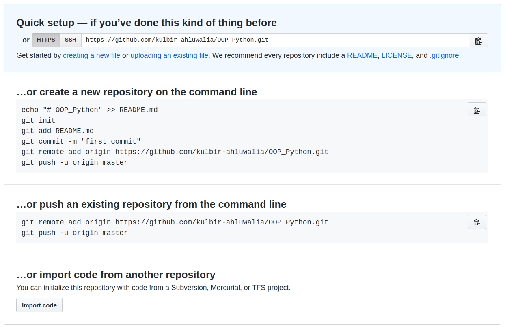

Credits: I am thankful to my friends Kanishka Ganguly, Sandeep Kota and Vishnu Dorbala and  for their support and guidance. The following work largely consists of tips and tricks I learnt from them.

To make a bootable pen drive using Ubuntu:
https://www.linuxtechi.com/create-bootable-usb-disk-dvd-ubuntu-linux-mint/

Adjust brightness, add a brightness controller:
```
sudo add-apt-repository ppa:apandada1/brightness-controller
sudo apt update
sudo apt install brightness-controller
```

```
Note:-
1. To align a window to the left half of the screen, use Ctrl+Windows+left arrow 
2. To align a window to the right half of the screen, use Ctrl+Windows+right arrow 
3. You can use .conf files to configure applications like the Z shell or TMUX. ".conf" stands for a **configuration** file used in Ubuntu in this case.
4. $ - the dollar sign represents the shell prompt and should not be typed - This is a Linux shell command line. 
```
# Recommended software for your Ubuntu system:-
1. **Oh-my-zsh** - Alternative for bash    
Note for zsh - Install PowerLevel9k theme, zsh-syntax-highlighting, zsh-autosuggestions enabled, fzf (Ctrl+R for searching previously entered commands, Ctrl+T for finding files, Alt+C for changing directory to some folder)  
**Make your terminal more productive** - https://medium.com/@ivanaugustobd/seu-terminal-pode-ser-muito-muito-mais-produtivo-3159c8ef77b2
2. **Tmux** - To organise multiple terminals
3. **Jupyter lab** - Helps in running sections of your code for testing
4. **PyCharm** - IDE for python, helps in visualising variable values, debugging - Go to settings>plugins. then search for spacegray theme and install it.
- In editor>colour scheme select Monokai. To get a sublime text editor *like* feel.
4.5. **CLion** - IDE for C++. Go to settings>plugins. then search for spacegray theme and install it.
- In editor>colour scheme select Vibrant Ink. Saves a lot of energy for OLED screens.
5. **ROS Melodic** for **Ubuntu 18.04**, ROS Kinetic for Ubuntu 16.04
6. **Sublime text**
7. Google Chrome
8. **OpenCV** - Build from source to optimize for your system - https://linuxize.com/post/how-to-install-opencv-on-ubuntu-18-04/#installing-opencv-from-the-source
9. **Psensors**: To monitor the temperature of your CPU cores and GPU, use Psensors. It has a GUI too:
https://www.tecmint.com/psensor-monitors-hardware-temperature-in-linux/
10. **Terminator** - Easier to use than TMUX. https://dev.to/xeroxism/how-to-install-terminator-a-linux-terminal-emulator-on-steroids-1m3h 
11. Pip: sudo apt install python3-pip
12. Nautilus: sudo apt-get install nautilus 
```
sudo apt-get install lm-sensors hddtemp  
sudo apt-get install psensor -y
sensors #to see temperatures
```

10. **OBS studio** - to record the screen - ```sudo snap install obs-studio```
11. **VLC media player** - ```sudo snap install vlc```
12. Install **snap** - ```sudo apt update``` and then ```sudo apt install snapd```
13. Install zoom - ```sudo snap install zoom-client   ```

# Helpful tips and commands for using the terminal
1. For copying in terminal, use Ctrl+Shift+C. 
2. For pasting in terminal, use Ctrl+Shift+V.
3. Use Tab for auto completion wherever possible.
---
4. Use workspaces to increase productivity. Shift windows to different workspaces using Ctrl+Shift+Alt+arrow keys.
5. Switch between workspaces using Ctrl+Alt+arrow keys.
6. To enable workspaces, go to System settings>Appearance>Enable workspaces.
---
7. A period "**.**" as the first character in the file name indicates that it’s a hidden file. For example, **~/.tmux.conf** is a hidden file at the location **~**.
8. **~** refers to the path **/home/kulbir**
9. To check your working directory, use the command **pwd**. It will tell you the path of the current working directory.
10. You probably know this, but yes, I will write it. The shortcut to open the terminal is **Ctrl+Alt+T**. 
11. You can copy a folder using Ctrl+C and then when you paste it in the terminal or in a text editor you'll directly get the path of that folder!

# WATCH THIS VIDEO - Thank me later
Terminal vs. Bash vs. Command line vs. Prompt
https://www.youtube.com/watch?v=hMSByvFHOro

# For copying using the terminal
Using the copy command with Recursive search (-R for recursive and -i for interactive):-
1. The path from where the file is **copied from** is written first.
2. The path where the file is **copied to** is written afterwards.
3. Use sudo to get permissions for copying as shown:-

```bash
sudo cp -Ri Source_Folder Destination_Folder
sudo cp -Ri ~/Downloads/tmux.conf  /usr/share/doc/tmux/examples
```

# For copying files using Nautilus GUI:-
```bash
sudo apt install nautilus-admin
nautilus #to open the nautilus file manager with root permissions
#simply right and choose "Open as Administrator" or to edit a file "Edit as Administrator"
```


---
# Basic writing and formatting syntax for GitHub
- https://help.github.com/en/github/writing-on-github/basic-writing-and-formatting-syntax
1. Double space is used for changing the line
2. Format for comments:-
```
<!--Insert your comment here-->
```
3. To insert an image, first upload the image to the repo and then:-
```
 </div>
```
---

# Using git to setup a repository for our python files

Installing git:-   
```bash
sudo apt-get install git
```

Setup username:-    
```bash
git config --global user.name "username"   #kulbir-ahluwalia
```  

Setup email:-  
```bash
git config --global user.email "your github registered email" #kulbir@terpmail.umd.edu
```  

Make a directory in your PC:-  
```bash
cd Documents/  
mkdir OOP
cd OOP/ 
```
---
Helpful tip:-
When you create the repository on GitHub don't provide any description or initialise it with a README.md file. 
So that you get the following menu with all the commands for setting the repo up:-
<!--For displaying image in GitHub-->

 </div>


---

To create a new repository on the command line:-  
```bash
#to create a readme file   
echo "# OOP_Python" >> README.md    

# to initialize empty git repository in the directory /home/kulbir/Documents/OOP_Python/.git/   
git init   

#to add the readme file   
git add README.md   

#to commit your file and save your changes  
#The comment regarding the purpose of the commit is written in double quotes  
git commit -m "first commit"    

#to add the remote origin, link the local directory on PC with the GitHub directory  
git remote add origin https://github.com/kulbir-ahluwalia/OOP_Python.git   

#to push your changes  
git push -u origin master     
```

# Adding new files using git
Create a new file in the directory /home/kulbir/Documents/OOP_Python:-  

```bash
nano OOP_practice_instances1.py 
```
To add the new file:-  
```
 git add OOP_practice_instances1.py  
 git add *    #to add all the files in the current working directory
 git add .    #alternate way to add all the files in the current working directory
 git add --all  #to add all files in the folder irrespective of your current working directory
 git add -A    #alternate way to add all files in the folder irrespective of your current working directory

```
To commit the file and save the changes with a custom comment describing the changes:-  

```
git commit -m "OOP_python_instances"
```
To add the remote origin, link the local directory on PC with the GitHub directory (If you haven't already done it) :-  
```
git remote add origin https://github.com/kulbir-ahluwalia/OOP_Python.git 
```
To push your changes:- 
Note: When you use the following command, the terminal will retun the message "1 file changed, 1 insertion(+) "
```
git push -u origin master  
```
---

# Converting a git repository folder to a normal folder
To do this, press ```Ctrl+H``` to view the hidden files and folders in your git repository folder.   
Then, just delete the .git folder and the .gitignore file.   
Ps - especially helpful when you want to convert a folder (with multiple git repo folders in it) to a git repo itself. You can make all git repo folders inside it into normal folders and then convert the main folder into a git repo.

# Cloning an existing git repository
Just change the working directory to wherever you would like to clone the existing repository. For example, here we clone to the Desktop. Then initialise the empty git repository using **git init**.
```
cd ~/Desktop
git init
```
Enter **git clone** followed by the https url of the repo that you want to clone:-
```
git clone https://github.com/kulbir-ahluwalia/ENPM_673_Perception.git
```
That's all folks! :)

# Removing files using git 

To remove the file from the git repository and from the directory on your system:-
Note: "rm" stands for "remove". When you use the following commands, the terminal will retun the message "1 file changed, 1 deletion(-)"

```
git rm OOP_practice_instances1.py  
git commit -m "deleted OOP_practice_instances1.py"
```
---
To remove the file only from the git repository and not from the directory on your system:-
```
git rm --cached OOP_practice_instances1.py
git commit -m "deleted OOP_practice_instances1.py"
```

To push changes to the existing repository on GitHub:-
```bash
git remote add origin https://github.com/kulbir-ahluwalia/OOP_Python.git 
git push -u origin master 
```

# Using Git Large File Storage
For uploading files greater than 100 MB to your GitHub repo, Just follow the steps here:-
https://git-lfs.github.com/ 


# Installing Jupyter notebook
This should launch the jupyter notebook with the option to create new files in python 2 and python 3:-
```
sudo apt install python-pip
sudo apt install python3-pip
pip install --upgrade pip
pip3 install --upgrade pip
pip install notebook
python -m pip install --upgrade pip setuptools wheel
sudo -H pip install jupyter
```
While pip alone is sufficient to install from pre-built binary archives, up to date copies of the setuptools and wheel projects are useful to ensure you can also install from source archives https://packaging.python.org/tutorials/installing-packages/:
```
pip3 install setuptools wheel
pip3 install jupyter
jupyter notebook #to launch the jupyter notebook
```
(Some commands maybe redundant but this is what worked...)
## Command mode vs Edit mode in Jupyter notebook
1. **Command mode** - For notebook level actions, recognised by a blue left margin of the cell and gray rectangle around the cell. 
To go into command mode, click in the area between the margin of the cell and the typing area.
2. **Edit mode** - For typing in a cell, recognised by a green left margin of the cell along with green rectangle around the cell. 
To go into edit mode, just click in the typing area.


## Jupyter keybaord shortcuts for the command mode
1. To run a cell and then move to the next cell - ```Shift```+```Enter``` 
2. To just run a cell and stay in that cell - ```Ctrl```+```Enter``` 
3. To run the cell and make a new cell below it - ```Alt```+```Enter```
4. To insert a cell above - ```A```
5. To insert a cell below - ```B```
6. To delete a cell - Douple tap ```D```
7. To switch the cell to markdown mode (used for writing explanations or making subsections) - ```M```
8. **Important** - To run shell commands in the jupyter notebook, use ```!``` followed by the command as shown:-
```
!pwd #followed by Shit+Enter
```
Other commands might not work! Double click D in Command mode to delete it.


## Jupyter Lab
Jupyter is cooler than jupyter notebook as it has more functions like accessing all the files open as tabs and also has the terminal. Watch this video to get a feel. https://www.youtube.com/watch?v=4AT1PcbEzjw. To install jupyter lab:-
```zsh
pip install jupyterlab
pip3 install jupyterlab
pip3 install --user nodejs  #required by jupyter lab
jupyter lab #to launch jupyter lab
```

### Commands to install modules in jupyter
1. To install numpy, scipy, matplotlib, sympy and :-
```
pip3 install numpy scipy matplotlib pandas sympy
```

2. Install scikit learn using:
```
pip install -U scikit-learn
pip3 install -U scikit-learn
python -m pip show scikit-learn # to see which version and where scikit-learn is installed
```
3. Install pandas using:
```
#Dependencies for pandas: setuptools, NumPy, python-dateutil, pytz
pip install python-dateutil
pip3 install python-dateutil
pip install pandas
pip3 install pandas
```

# C++ in Jupyter
Install clang
```
sudo apt update
sudo apt install clang
```

# Install nvidia driver in Ubuntu 16.04
```bash
prime-select query     #to see which graphic card is being used right now
sudo add-apt-repository ppa:graphics-drivers/ppa
sudo apt update
#Open additional drivers tab in softwares and updates
software-properties-gtk  #to open softwares and updates
#choose your driver version and click apply changes
#reboot, use nvidia-smi to check the driver version
sudo prime-select intel   # switch to intel
sudo prime-select nvidia  # switch to nvidia

sudo ubuntu-drivers devices    #to see recommended drivers for the graphic cards that you have
nvidia-settings    #to open nvidia x server settings

#in case you want to uninstall all nvidia drivers,
sudo apt purge nvidia-*
```
Ref - https://www.linuxbabe.com/desktop-linux/switch-intel-nvidia-graphics-card-ubuntu

---
# References
1. For git commands - https://rogerdudler.github.io/git-guide/
2. For using git and GitHub - https://youtu.be/SwK2dPFXhpU
3. For TMUX - https://youtu.be/Lqehvpe_djs
4. For git commands with examples - https://rubygarage.org/blog/most-basic-git-commands-with-examples
5. For Jupyter keyboard shortcuts - http://maxmelnick.com/2016/04/19/python-beginner-tips-and-tricks.html
6. For using Nautilus - https://vitux.com/how-to-open-and-edit-files-and-folders-in-ubuntu-desktop-as-an-administrator/

